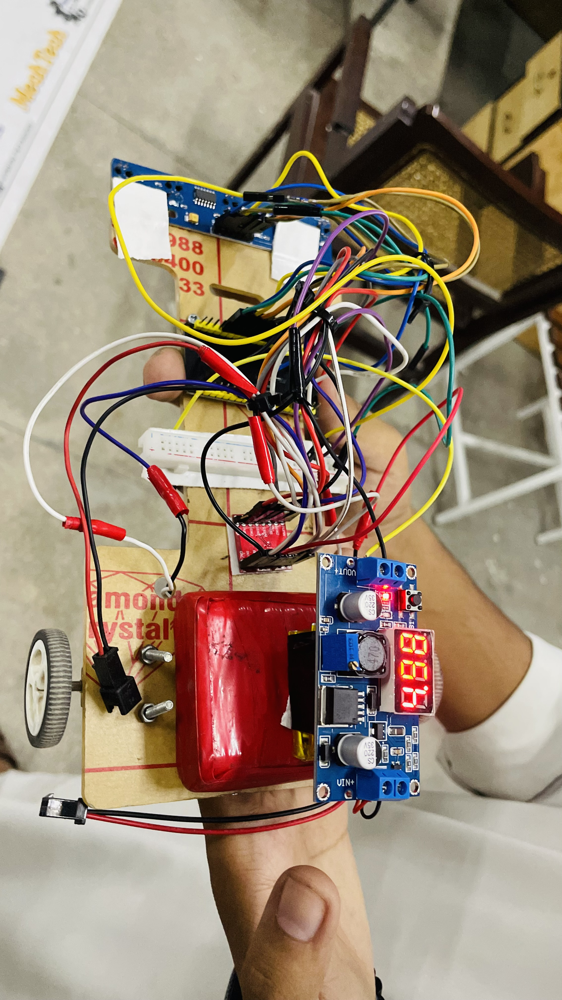
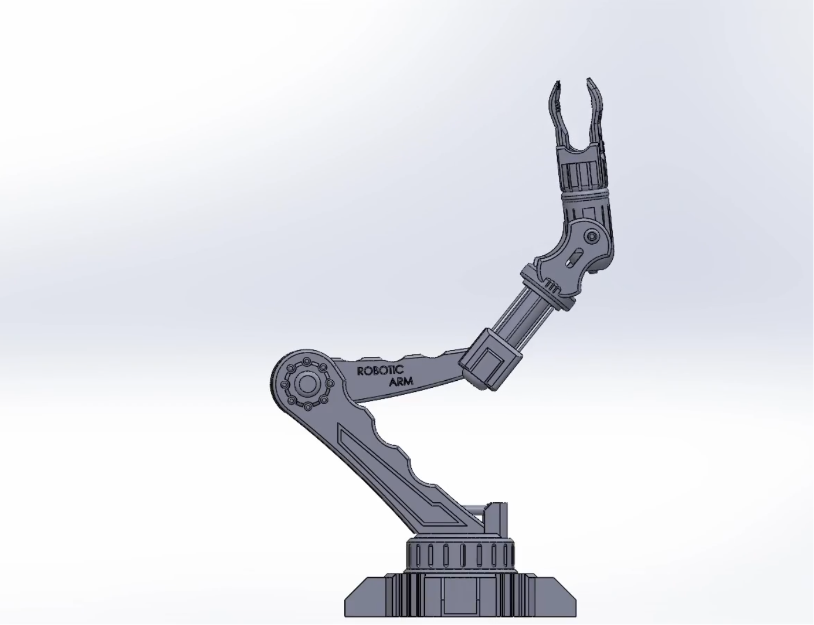
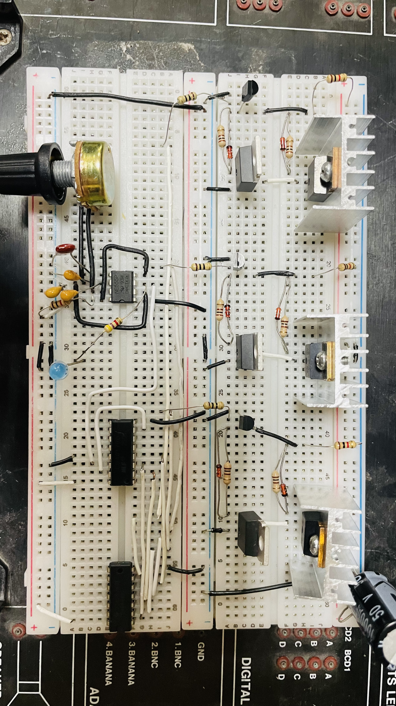
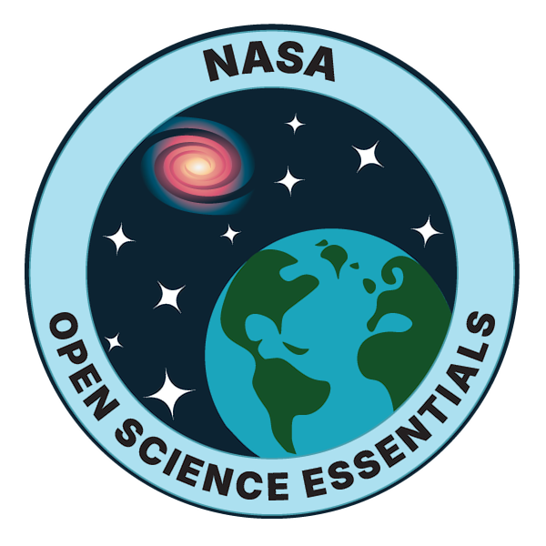
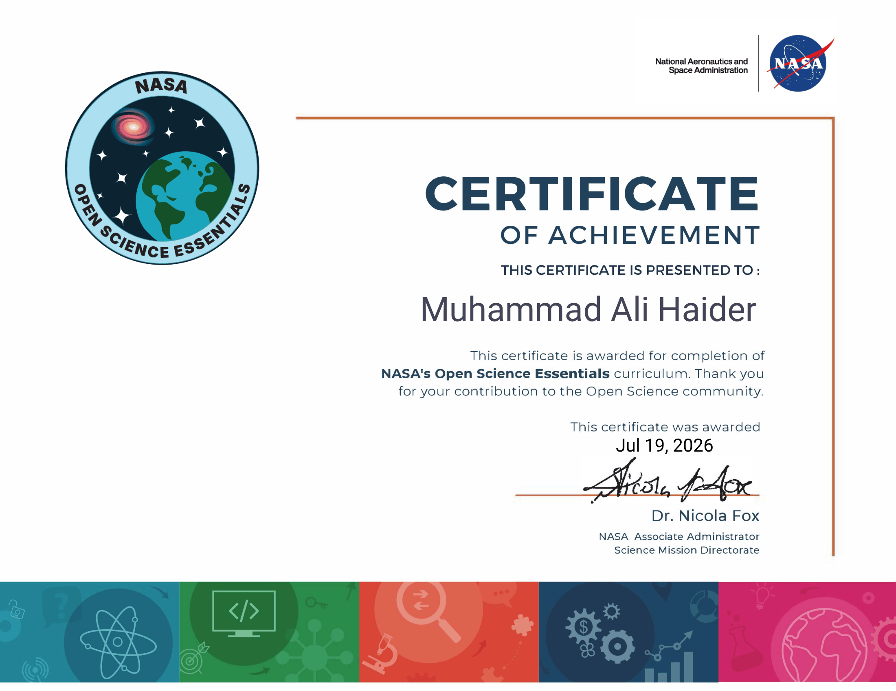

 

  

---

# 👨‍💻 About Me

I'm **Muhammad Ali Haider**, a **Mechatronics Engineering Student** at the **University of Engineering and Technology (UET) Lahore, Pakistan**.

I enjoy building engineering projects that combine **software, electronics, and mechanical design**. My interests include **Artificial Intelligence, Robotics, Embedded Systems, Computer Vision, Control Systems, and CAD Design**.

I believe in learning through practical experience. Every project I build helps me strengthen my programming, electronics, mechanical design, and problem-solving skills while preparing for a career in intelligent engineering systems.

---

## 🎓 Education

- 🎓 **Bachelor of Science in Mechatronics Engineering**
- 🏫 **University of Engineering and Technology (UET) Lahore**
- 📅 **2025 – Present**
- 📖 **Current Semester:** 3rd

---

## 🎯 Current Focus

- 🤖 Artificial Intelligence
- 🦾 Robotics
- ⚡ Embedded Systems
- 👁️ Computer Vision
- ⚙️ Control Systems
- 🔩 CAD Design
- 💻 Python Programming
- 🐧 Linux & Git

---

## 🌱 Currently Learning

- Python for Engineering Applications
- Machine Learning Fundamentals
- Embedded Systems Development
- Git & GitHub
- Linux
- Computer Vision

---

# 🛠️ Tech Stack

## 💻 Programming Languages

  

  

---

## 🤖 Embedded Systems

  
  
  

---

## ⚙️ CAD & Engineering Software

  
  

---

## 🧰 Development Tools

  

  

---

## 🎯 Engineering Interests

---

---

# 🚀 Featured Projects

## 🤖 ESP32 Line Following Robot

### 📖 Overview

An autonomous **ESP32-based Line Following Robot** capable of detecting and following a predefined path using multiple IR sensors. The robot continuously processes sensor readings and adjusts motor speed to maintain accurate line tracking.

### ✨ Features

- 🚗 Autonomous line following
- ⚡ ESP32 Microcontroller
- 🎯 PID-based control algorithm
- 🔍 Multi-IR sensor array
- 🔄 Real-time motor correction
- ⚙️ TB6612 Motor Driver
- 💻 Developed using Arduino IDE

### 🛠️ Technologies

### 🔗 Repository

[ESP32 Line Following Robot](https://github.com/hafizalihaider/ESP32-Line-Following-Robot)

---

# 📂 Other Engineering Projects

## 🦾 Robotic Arm Design

## ⚡ Three-Phase BLDC Motor Controller

| Project | Category | Status |
|---------|----------|--------|
| ⚡ Three-Phase BLDC Motor Controller (Without Microcontroller) | Electronics | Documentation in Progress |
| 🦾 Robotic Arm Design | SolidWorks CAD | Documentation in Progress |
| 🌉 Truss Bridge Design | Structural Design | Documentation in Progress |
| 🔩 Drill Vice Design | Mechanical Design | Documentation in Progress |
| 🐍 Python Mini Projects | Python | Repository Coming Soon |

> **Note:** I prefer publishing well-documented projects rather than uploading incomplete work. More repositories will be added as they are finalized.

---

---

# 💼 Experience & Training

## ✈️ Engineering Virtual Experience
**British Airways (Forage)**

✅ Completed

- Successfully completed the British Airways Engineering Virtual Experience Program.
- Worked on engineering case studies related to aircraft maintenance and technical documentation.
- Applied engineering analysis and problem-solving approaches.

**Skills:** Engineering Analysis • Technical Documentation • Problem Solving

---

## 🚀 NASA Open Science Essentials

**NASA**

✅ Completed

- Completed NASA Open Science Essentials training.
- Learned concepts related to open science, research practices, and scientific collaboration.

**Skills:** Open Science • Research • Scientific Collaboration

---

## 🐍 Python Programming Intern
**Arch Technologies**

🔄 Currently Doing

- Developing Python programming skills through practical tasks and projects.
- Improving programming logic, debugging skills, and problem-solving techniques.
- Working with Python fundamentals and application development.

**Skills:** Python • Programming Fundamentals • Problem Solving • Debugging

---

## 🛡️ Cyber Security Intern
**Arch Technologies**

🔄 Currently Doing

- Learning cybersecurity fundamentals and security concepts.
- Exploring encryption, network security, vulnerabilities, and security practices.
- Building understanding of cybersecurity tools and methodologies.

**Skills:** Cyber Security • Encryption • Networking • Security Fundamentals

---

## 🛡️ Cyber Security Intern
**Decode Lab**

🔄 Currently Doing

- Learning cybersecurity concepts and practical security approaches.
- Exploring security awareness, threats, and protection techniques.

**Skills:** Cyber Security • Security Fundamentals • Networking

---

## 🐍 Python Programming Intern
**Code Alpha**

🔄 Currently Doing

- Developing Python programming skills through internship tasks.
- Practicing Python concepts, logic building, and small applications.

**Skills:** Python • Programming • Debugging

---

## ⚙️ C Programming Intern
**Progree**

🔄 Currently Doing

- Improving C programming fundamentals.
- Practicing problem solving and algorithm development using C language.

**Skills:** C Programming • Algorithms • Problem Solving

# 📜 Certifications & Courses

| Certification / Training | Organization | Status |
|---|---|---|
| 🚀 NASA Open Science Essentials | NASA | ✅ Completed |
| ✈️ Engineering Virtual Experience | British Airways (Forage) | ✅ Completed |
| 🐍 Python Programming Internship | Arch Technologies | 🔄 In Progress |
| 🛡️ Cyber Security Internship | Arch Technologies | 🔄 In Progress |
| 🛡️ Cyber Security Internship | Decode Labs | 🔄 In Progress |
| 🐍 Python Programming Internship | Code Alpha | 🔄 In Progress |
| ⚙️ C Programming Internship | Progree | 🔄 In Progress |

---

# 🏅 Highlights

- 🚀 NASA Open Science Essentials Certified
- 🐍 Currently developing Python programming skills through internships
- 🛡️ Currently learning Cyber Security fundamentals
- ✈️ Completed British Airways Engineering Virtual Experience
- 🤖 Building projects in Robotics and Embedded Systems
- 🎓 BS Mechatronics Engineering Student at UET Lahore

---

---

# 📊 GitHub Analytics

  

  

---

# 📈 GitHub Overview

| Profile | Information |
|:--------:|:-----------|
| 👤 **Username** | **hafizalihaider** |
| 🎓 **Education** | BS Mechatronics Engineering |
| 🏫 **University** | UET Lahore |
| 📍 **Location** | Pakistan |
| 💻 **Languages** | Python, C, C++, MATLAB |
| 🤖 **Interests** | AI, Robotics, Embedded Systems |
| 🌱 **Currently Learning** | Machine Learning, Computer Vision, Linux |

---

# 🎯 2026 Goals

- ✅ Build high-quality engineering projects
- 🤖 Learn Artificial Intelligence in depth
- ⚡ Master Embedded Systems
- 👁️ Learn Computer Vision
- 🌐 Contribute to Open Source
- 🚀 Publish more GitHub repositories
- 📚 Continuously improve programming skills

---

---

# 🏆 Engineering Journey

### 🎓 2025
- Started **Bachelor of Science in Mechatronics Engineering** at **University of Engineering and Technology (UET) Lahore**.
- Began learning **C Programming**, **Python**, and engineering fundamentals.

---

### ⚙️ Engineering Design

- 🦾 Designed a **Robotic Arm** in SolidWorks.
- 🌉 Completed a **Truss Bridge Design** project.
- 🔩 Designed a **Drill Vice** assembly in SolidWorks.

---

### 🤖 Robotics & Embedded Systems

- Built an **ESP32 Line Following Robot** using:
  - ESP32
  - IR Sensor Array
  - TB6612 Motor Driver
  - PID-based Line Following Algorithm

- Designed a **Three-Phase BLDC Motor Controller** without using a microcontroller.

---

### 💼 Professional Experience

- 🐍 Python Programming Intern — **Arch Technologies**
- 🛡️ Cyber Security Intern — **Arch Technologies**
- 💻 Python Development Intern — **Decode Labs**
- ✈️ Engineering Virtual Experience — **British Airways (Forage)**

---

### 📜 Certifications

- 🚀 NASA Open Science Essentials
- 🐍 Python Programming Internship
- 🛡️ Cyber Security Internship
- 💻 Python Development Internship
- ⚙️ C Programming Internship
- ✈️ British Airways Engineering Virtual Experience

---

# 🏅 Achievements

- 🚀 Completed the **NASA Open Science Essentials** course.
- 🤖 Developed an **ESP32 Line Following Robot**.
- ⚡ Designed a **Three-Phase BLDC Controller** using discrete electronics.
- 🦾 Completed multiple **SolidWorks mechanical design projects**.
- 💼 Successfully completed multiple technical internships.
- 🎓 Currently pursuing **BS Mechatronics Engineering** at **UET Lahore**.

---

# 🎯 Career Objective

I aim to build innovative engineering solutions by combining **Artificial Intelligence**, **Robotics**, **Embedded Systems**, and **Mechanical Design**. My goal is to contribute to projects that solve real-world challenges while continuously improving my technical and professional skills.

---

---

# 🌐 Connect With Me

  

---

# 🤝 Let's Connect

I'm always open to connecting with:

- 🤖 Robotics Enthusiasts
- 💻 Software Developers
- 🧠 AI & Machine Learning Learners
- ⚡ Embedded Systems Engineers
- 🎓 Students & Researchers
- 🌍 Open-Source Contributors

If you'd like to collaborate on engineering projects, discuss technology, or share ideas, feel free to connect with me through LinkedIn or GitHub.

---

# 📬 Contact

- 📧 **Email:** hafizalihaider1942@gmail.com
- 📍 **Location:** Lahore, Pakistan
- 🎓 **University:** University of Engineering and Technology (UET) Lahore
- 💼 **Status:** Mechatronics Engineering Student

---

