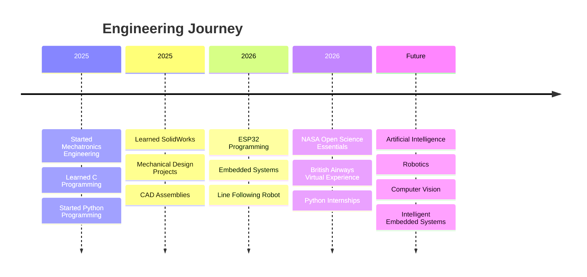

 

  

  

---

#  About Me

I'm **Muhammad Ali Haider**, a **Mechatronics Engineering Student** at the **University of Engineering and Technology (UET) Lahore, Pakistan**, currently in my **3rd semester**.

I am passionate about designing intelligent systems that combine **Artificial Intelligence, Robotics, Embedded Systems, Electronics, and Mechanical Engineering** to solve real-world problems.

My journey began with programming and electronics and has grown into building autonomous robots, embedded systems, CAD models, and AI-powered applications. I enjoy turning engineering concepts into practical, working solutions through continuous learning and hands-on projects.

 

### 🎯 Current Focus

- 🤖 Artificial Intelligence
- 🦾 Robotics
- ⚡ Embedded Systems
- 👁️ Computer Vision
- 🧠 Machine Learning
- ⚙️ Control Systems
- 🔩 CAD Design (SolidWorks)
- 🔌 Electronics
- 🛡️ Cyber Security
- 🌐 Internet of Things (IoT)

---

### 🌱 Currently Learning

- Advanced Python Programming
- Embedded AI
- Linux
- Git & GitHub
- Computer Vision
- Machine Learning
- ESP32 Development
- Robotics Algorithms

---

### 💡 Engineering Philosophy

> *"Engineering is not just about building machines—it's about creating intelligent solutions that improve the world through innovation, curiosity, and continuous learning."*

---

---

# 🛠️ Tech Stack

## 💻 Programming Languages

  

---

## ⚙️ Embedded Systems & Electronics

  

---

## 🤖 Engineering Software

  
  

---

## 💼 Development Tools

  

---

## 🎯 Areas of Interest

---

---

# 🚀 Featured Project

## 🤖 ESP32 Line Following Robot

An autonomous **Line Following Robot (LFR)** developed using the **ESP32** microcontroller. The robot is designed to detect and accurately follow a predefined path using multiple IR sensors while controlling dual DC motors through a motor driver.

### ✨ Key Features

- ⚡ ESP32-based control system
- 🛣️ Multi-sensor line detection
- 🎯 PID-based line following
- 🔄 Real-time motor speed correction
- 🚗 Differential drive mechanism
- ⚙️ TB6612 Motor Driver
- 🔋 Optimized for smooth navigation

### 🛠️ Technologies Used

### 🔗 Repository

https://github.com/hafizalihaider/ESP32-Line-Following-Robot

---

# 🔬 Engineering Projects

Although not all of my work is currently open source, I have completed projects in the following areas:

| Project | Category | Status |
|---------|----------|--------|
| 🤖 ESP32 Line Following Robot | Embedded Systems | ✅ Public |
| ⚡ Three-Phase BLDC Motor Controller (Without Microcontroller) | Electronics | 🔒 Private |
| 🦾 Robotic Arm Design | SolidWorks CAD | 📷 Documentation Available |
| 🌉 Truss Bridge Design | Structural Design | 📷 Documentation Available |
| 🔩 Drill Vice Design | Mechanical Design | 📷 Documentation Available |
| 🐍 Python Mini Projects | Python | 🚧 Preparing Repository |

> **Note:** Additional projects and documentation will be published as they are organized for open-source release.

---

---

# 🎓 Education

| Degree | Institution | Duration | Status |
|:-------:|:-----------:|:--------:|:------:|
| **Bachelor of Science in Mechatronics Engineering** | **University of Engineering and Technology (UET) Lahore** | 2025 – Present | 📖 3rd Semester |

### 📚 Relevant Areas of Study

- 🤖 Robotics
- ⚡ Electronics
- 🖥️ Programming
- 📐 Engineering Mathematics
- ⚙️ Engineering Mechanics
- 🔌 Digital Logic Design
- 🎛️ Control Systems
- 🛠️ CAD Design

---

# 💼 Experience

## 🐍 Python Programming Intern

**CodeAlpha**

- Completed a Python Programming Internship.
- Developed Python-based applications and programming exercises.
- Strengthened problem-solving and programming fundamentals.
- Gained practical experience through assigned development tasks.

**Skills Gained**

- Python Programming
- Problem Solving
- Debugging
- Software Development

---

## 💻 Python Development Intern

**Decode Labs**

- Worked on Python programming assignments and practical tasks.
- Improved coding practices and project organization.
- Gained experience using Git and GitHub for version control.
- Enhanced software development workflow through hands-on learning.

**Skills Gained**

- Python
- Git
- GitHub
- Programming Fundamentals
- Version Control

---

## ✈️ Engineering Virtual Experience

**British Airways (Forage)**

- Completed the British Airways Engineering Virtual Experience Program.
- Investigated engineering scenarios using structured technical workflows.
- Analysed engineering documentation and maintenance procedures.
- Improved technical reporting and engineering decision-making skills.

**Skills Gained**

- Engineering Analysis
- Technical Documentation
- Problem Solving
- Engineering Communication

---

---

# 📊 GitHub Analytics

  

---

# 📈 Contribution Activity

---

# 🏆 GitHub Achievements

---

# 📊 Profile Summary

 

 

---

---

# 🛣️ My Engineering Journey

---

# 🎯 Engineering Interests

| 🤖 Artificial Intelligence | ⚡ Embedded Systems | 🦾 Robotics |
|:-------------------------:|:------------------:|:-----------:|
| Developing intelligent systems that solve engineering problems using AI. | Building hardware and software solutions using ESP32 and microcontrollers. | Designing autonomous robotic systems integrating mechanics, electronics, and software. |

| 👁️ Computer Vision | ⚙️ Mechanical Design | 🛡️ Cyber Security |
|:------------------:|:-------------------:|:----------------:|
| Learning image processing and AI-based visual perception. | Designing engineering components and assemblies using SolidWorks. | Exploring security concepts to build safer and more reliable systems. |

---

# 📚 Technical Skills

| Category | Skills |
|----------|--------|
| Programming | Python • C • C++ • MATLAB |
| Embedded Systems | ESP32 • Arduino IDE |
| CAD | SolidWorks |
| Electronics | Proteus • Digital Electronics • Control Systems |
| Development Tools | Git • GitHub • VS Code • Linux |
| Other | Technical Documentation • Engineering Design |

---

# 📌 Current Goals

- 🎯 Build high-quality engineering projects.
- 🤖 Expand my knowledge of Artificial Intelligence.
- ⚡ Improve embedded systems development skills.
- 👁️ Learn advanced Computer Vision.
- 🌍 Contribute to open-source engineering projects.
- 📖 Continue learning every day.

---

# 💭 Engineering Mindset

> **"Continuous learning, practical engineering, and curiosity are the foundation of every great innovation."**

---

---

# 🌐 Connect With Me

&nbsp;&nbsp;&nbsp;

&nbsp;&nbsp;&nbsp;

&nbsp;&nbsp;&nbsp;

 

---

# 📫 Let's Collaborate

I'm always interested in connecting with fellow students, developers, engineers, and researchers.

Whether it's:

🤖 Robotics

⚡ Embedded Systems

🧠 Artificial Intelligence

👁️ Computer Vision

🔩 Mechanical Design

🐍 Python Development

feel free to reach out through LinkedIn or GitHub.

---

# ⭐ Thanks for Visiting

### If you like my work, consider ⭐ starring my repositories.

