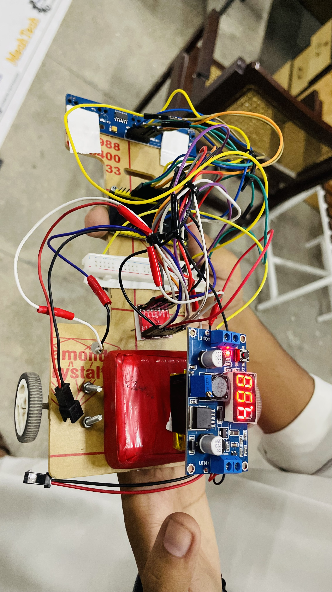
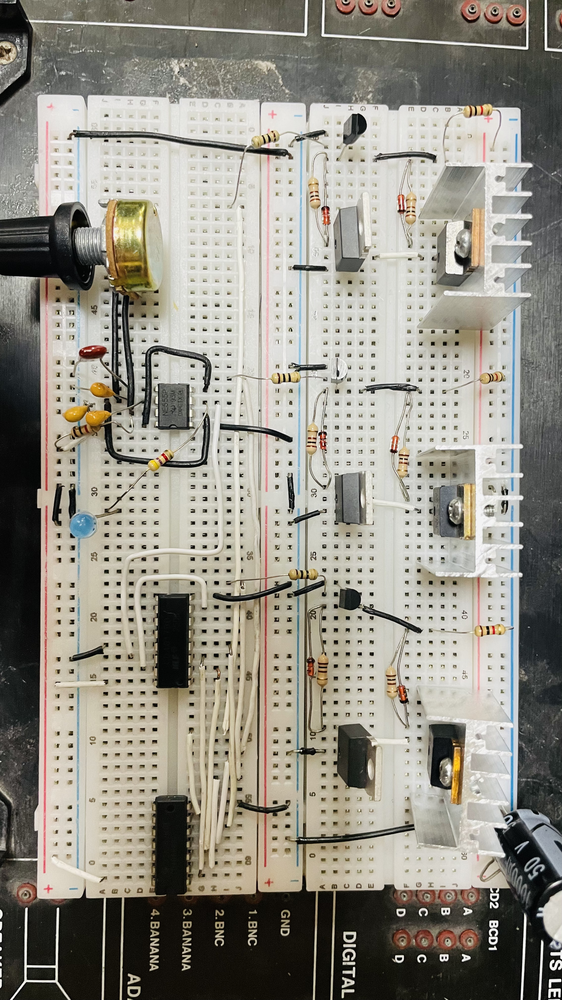
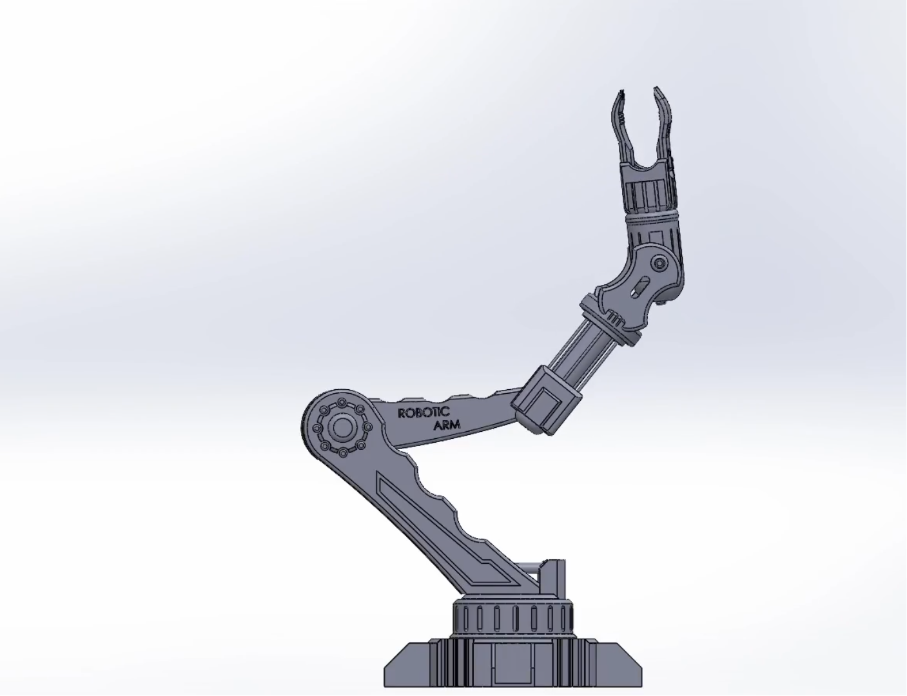

 

  

  

---

# 👨‍💻 About Me

I am **Muhammad Ali Haider**, a **Mechatronics Engineering student at the University of Engineering and Technology (UET) Lahore**.

My work focuses on combining **software, electronics, mechanical design, and control** to build intelligent engineering systems.

My primary technical interests include:

* 🤖 Robotics & Autonomous Systems
* ⚡ Embedded Systems
* 🎛️ Control Systems
* 👁️ Computer Vision
* 🧠 Artificial Intelligence & Machine Learning
* ⚙️ Mechatronic System Design
* 🔩 Mechanical CAD

I am currently focused on strengthening my foundations in **programming, mathematics, control, embedded systems, and experimental engineering** while developing increasingly rigorous robotics and intelligent-system projects.

---

# 🎓 Education

<table>
<tr>
<th>Degree</th>
<th>Institution</th>
<th>Period</th>
<th>Status</th>
</tr>

<tr>
<td>BS Mechatronics Engineering</td>
<td>University of Engineering and Technology (UET) Lahore</td>
<td>2025 – Present</td>
<td>3rd Semester</td>
</tr>

</table>

---

# 🧠 Technical Interests

 

---

# 🛠️ Technical Stack

## 💻 Programming

  

## ⚡ Embedded Systems

## ⚙️ Engineering & CAD

## 🧰 Development Tools

---

# 🚀 Featured Projects

## 🤖 ESP32 Line Following Robot

### Overview

An autonomous mobile robot built around an **ESP32** that detects and follows a predefined path using an array of infrared sensors.

The controller continuously processes sensor feedback and adjusts motor commands to maintain the robot's position relative to the line.

### Key Features

* ESP32-based embedded controller
* Multi-IR sensor array
* PID-based control algorithm
* TB6612FNG motor driver
* Real-time sensor processing
* Differential motor control
* Arduino/C++ firmware

### Engineering Concepts

`Embedded Systems` `Feedback Control` `PID` `Sensor Processing` `Real-Time Systems`

---

## ⚡ Three-Phase BLDC Motor Controller

Designed and tested a **three-phase BLDC motor controller without a microcontroller**, focusing on electronic commutation, switching behavior, and motor-control principles.

### Engineering Concepts

`BLDC Motors` `Electronic Commutation` `Power Electronics` `Switching Circuits` `Motor Control`

---

## 🦾 Robotic Arm Design

A mechanical robotic arm designed in **SolidWorks**, focusing on component modeling, assembly relationships, and mechanical system design.

### Engineering Concepts

`SolidWorks` `3D CAD` `Mechanical Design` `Assembly Modeling`

---

# 📂 Additional Projects

<table>
<tr>
<th>Project</th>
<th>Technical Area</th>
</tr>

<tr>
<td>Matrix Engineering Tool</td>
<td>C Programming & Input Validation</td>
</tr>

<tr>
<td>Transactional Banking Ledger Engine</td>
<td>C & Dynamic Memory Management</td>
</tr>

<tr>
<td>Truss Bridge Design</td>
<td>Structural Engineering</td>
</tr>

<tr>
<td>Drill Vice Design</td>
<td>Mechanical CAD</td>
</tr>

<tr>
<td>Python Engineering Utilities</td>
<td>Python Programming</td>
</tr>

<tr>
<td>Cybersecurity Analysis Projects</td>
<td>Cybersecurity & Networking</td>
</tr>

</table>

---

# 💼 Experience

## 🛡️ Cybersecurity Intern — Decode Labs

**Completed**

Worked on practical cybersecurity concepts involving security awareness, threat analysis, networking fundamentals, and defensive security practices.

**Focus:** Cybersecurity • Networking • Security Fundamentals

---

## 🐍 Python Programming Intern — Code Alpha

**Completed**

Developed Python programming skills through practical tasks involving programming logic, debugging, and application development.

**Focus:** Python • Problem Solving • Debugging

---

## ⚙️ C Programming Intern — Progree

**Completed**

Strengthened C programming fundamentals through practical tasks involving programming logic, algorithms, memory management, and problem solving.

**Focus:** C • Algorithms • Problem Solving

---

## ✈️ Engineering Virtual Experience — British Airways / Forage

**Completed**

Completed an engineering-focused virtual experience involving technical case studies, engineering analysis, and technical documentation.

**Focus:** Engineering Analysis • Technical Documentation • Problem Solving

---

# 📜 Certifications & Training

<table>
<tr>
<th>Certification / Training</th>
<th>Organization</th>
<th>Status</th>
<th>Credential</th>
</tr>

<tr>
<td>NASA Open Science Essentials</td>
<td>NASA</td>
<td>✅ Completed</td>
<td><a href="./assets/certificates/nasa-open-science.pdf">View Certificate</a></td>
</tr>

<tr>
<td>Engineering Virtual Experience</td>
<td>British Airways / Forage</td>
<td>✅ Completed</td>
<td><a href="./assets/certificates/british-airways.pdf">View Certificate</a></td>
</tr>

<tr>
<td>Cybersecurity Internship</td>
<td>Decode Labs</td>
<td>✅ Completed</td>
<td><a href="./assets/certificates/decode-labs.pdf">View Certificate</a></td>
</tr>

<tr>
<td>Python Programming Internship</td>
<td>Code Alpha</td>
<td>✅ Completed</td>
<td><a href="./assets/certificates/code-alpha.pdf">View Certificate</a></td>
</tr>

<tr>
<td>C Programming Internship</td>
<td>Progree</td>
<td>✅ Completed</td>
<td><a href="./assets/certificates/progree.pdf">View Certificate</a></td>
</tr>

</table>

 

  

---

# 🔬 Research Direction

I am building the technical foundations required for future research in:

* Intelligent robotic systems
* Autonomous systems
* Learning-based control
* Computer vision for robotics
* Embedded AI
* Sensor fusion
* Control and optimization
* Human–robot interaction

My long-term objective is to contribute to research involving **intelligent, autonomous, and physically grounded engineering systems**.

---

# 🌱 Currently Working On

<table>
<tr>
<th>Area</th>
<th>Current Focus</th>
</tr>

<tr>
<td>Programming</td>
<td>C, Python, Data Structures & Algorithms</td>
</tr>

<tr>
<td>Robotics</td>
<td>Embedded Control & Autonomous Systems</td>
</tr>

<tr>
<td>Artificial Intelligence</td>
<td>Machine Learning Fundamentals</td>
</tr>

<tr>
<td>Computer Vision</td>
<td>Vision-Based Engineering Applications</td>
</tr>

<tr>
<td>Systems</td>
<td>Linux, Git & Embedded Development</td>
</tr>

<tr>
<td>Engineering</td>
<td>Control Systems & Mechatronic Design</td>
</tr>

</table>

---

# 📊 GitHub Activity

  

---

# 🎯 2026 Objectives

<table>
<tr>
<th>Objective</th>
<th>Status</th>
</tr>

<tr>
<td>Build rigorous engineering projects</td>
<td>🔄 In Progress</td>
</tr>

<tr>
<td>Strengthen C & Python</td>
<td>🔄 In Progress</td>
</tr>

<tr>
<td>Study Machine Learning</td>
<td>🔄 In Progress</td>
</tr>

<tr>
<td>Develop stronger robotics systems</td>
<td>🔄 In Progress</td>
</tr>

<tr>
<td>Learn Computer Vision</td>
<td>🔄 In Progress</td>
</tr>

<tr>
<td>Contribute to Open Source</td>
<td>🎯 Planned</td>
</tr>

</table>

---

# 📬 Connect

---

### Building systems. Learning fundamentals. Moving toward research.

