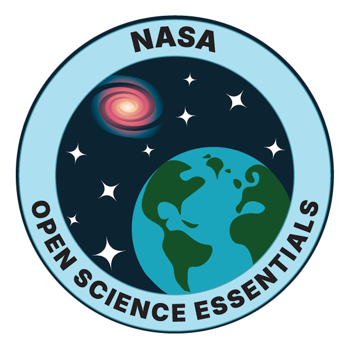

 

---

# About Me

I am **Muhammad Ali Haider**, a **Mechatronics Engineering student at the University of Engineering and Technology (UET) Lahore**.

I am interested in the intersection of **robotics, embedded systems, control, artificial intelligence, and mechanical design**.

My current work is focused on building strong foundations in **programming, electronics, control systems, mathematical modeling, and engineering design** through hands-on projects.

I am particularly interested in how **intelligent algorithms can be integrated with physical systems** to create autonomous and adaptive machines.

---

# Education

<table>
<tr>
<th>Qualification</th>
<th>Institution</th>
<th>Period</th>
</tr>

<tr>
<td><b>BS Mechatronics Engineering</b></td>
<td>University of Engineering and Technology (UET) Lahore</td>
<td>2025 – Present</td>
</tr>

<tr>
<td><b>Intermediate — Pre-Engineering</b></td>
<td>Forman Christian College, Lahore</td>
<td>2023 – 2025</td>
</tr>

<tr>
<td><b>Matriculation — Science (Biology)</b></td>
<td>Dar-e-Arqam School</td>
<td>2021 – 2023</td>
</tr>

</table>

---

# Research Interests

 

---

# Technical Foundations

## Programming

  

## Embedded Systems

## Engineering & CAD

## Development Environment

---

# Selected Engineering Work

## ESP32 Line Following Robot

An autonomous mobile robot developed around an **ESP32** for real-time path tracking.

The system uses an infrared sensor array to obtain feedback from the environment and adjusts differential motor commands through a **PID-based control strategy**.

### Technical Components

- ESP32
- Multi-channel IR sensor array
- TB6612FNG motor driver
- PID feedback control
- Differential drive
- Arduino/C++

### Focus Areas

`Embedded Systems` `Feedback Control` `PID` `Sensor Processing` `Robotics`

---

# Engineering Projects

<table>
<tr>
<th>Project</th>
<th>Area</th>
<th>Evidence</th>
</tr>

<tr>
<td><b>Three-Phase BLDC Motor Controller</b></td>
<td>Power Electronics & Motor Control</td>
<td><a href="./assets/bldc-controller.png">View</a></td>
</tr>

<tr>
<td><b>Robotic Arm Design</b></td>
<td>Mechanical Design & SolidWorks</td>
<td><a href="./assets/robotic-arm.png">View</a></td>
</tr>

<tr>
<td><b>Truss Bridge Design</b></td>
<td>Structural Engineering</td>
<td><a href="./assets/truss-bridge.png">View</a></td>
</tr>

<tr>
<td><b>Drill Vice Manufacturing</b></td>
<td>Mechanical Design & Manufacturing</td>
<td><a href="./assets/drill-vice.png">View</a></td>
</tr>

</table>

---

# Experience & Credentials

<table>
<tr>
<th>Experience</th>
<th>Organization</th>
<th>Status</th>
<th>Credentials</th>
</tr>

<tr>
<td>Cybersecurity Intern</td>
<td>Decode Labs</td>
<td>Completed</td>
<td>
<a href="./assets/decodelab-certificate.png">Certificate</a>
&nbsp;|&nbsp;
<a href="./assets/decodelab-lor.png">Letter of Recommendation</a>
</td>
</tr>

<tr>
<td>Python Programming Intern</td>
<td>Code Alpha</td>
<td>Completed</td>
<td>
<a href="./assets/codealpha-certificate.png">Certificate</a>
&nbsp;|&nbsp;
<a href="./assets/codealpha-lor.png">Letter of Recommendation</a>
</td>
</tr>

<tr>
<td>C Programming Intern</td>
<td>Progree</td>
<td>Completed</td>
<td>
<a href="./assets/progree-certificate.png">Certificate</a>
&nbsp;|&nbsp;
<a href="./assets/progree-lor.png">Letter of Recommendation</a>
</td>
</tr>

<tr>
<td>Engineering Virtual Experience</td>
<td>British Airways / Forage</td>
<td>Completed</td>
<td>
<a href="./assets/british-airways.png">Credential</a>
</td>
</tr>

<tr>
<td>Space Camp 2026</td>
<td>Resolve / SUPARCO</td>
<td>Completed</td>
<td>
<a href="./assets/space-camp-certficate.png">Credential</a>
</td>
</tr>

</table>

---

# NASA Open Science Essentials

  

### NASA Open Science Essentials

Completed training covering **open science, research practices, scientific collaboration, and reproducibility**.

 

---

# Current Learning

<table>
<tr>
<th>Area</th>
<th>Focus</th>
</tr>

<tr>
<td>Programming</td>
<td>C, Python, Algorithms & Data Structures</td>
</tr>

<tr>
<td>Robotics</td>
<td>Embedded Control & Autonomous Systems</td>
</tr>

<tr>
<td>Artificial Intelligence</td>
<td>Machine Learning Fundamentals</td>
</tr>

<tr>
<td>Computer Vision</td>
<td>Vision-Based Engineering Applications</td>
</tr>

<tr>
<td>Control</td>
<td>Feedback Systems & Control Theory</td>
</tr>

<tr>
<td>Engineering</td>
<td>Mechatronic Design & Experimental Development</td>
</tr>

</table>

---

# Research Direction

My long-term academic interests are centered around **intelligent and autonomous physical systems**.

Areas I intend to explore more deeply include:

- Autonomous robotics
- Learning-based control
- Robot perception
- Computer vision for robotics
- Embedded intelligence
- Sensor fusion
- Human–robot interaction
- Optimization and control

I am currently focused on developing the **mathematical, programming, and engineering foundations** required to contribute to research in these areas.

---

# Connect

---

### Building strong foundations for intelligent engineering systems.

